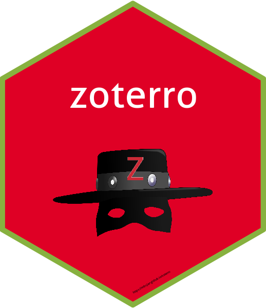

<!-- README.md is generated from README.Rmd. Please edit that file -->

# zoterro 

<!-- badges: start -->

[](https://github.com/mbojan/zoterro/actions)
<!-- badges: end -->

Zoterro is a simple R client to Zotero web API (ver. 3).

Primary motivation was a need to fetch bibliographical information
managed by Zotero to local RMarkdown project.

See <https://www.zotero.org/support/dev/web_api/v3/basics> for what is
available.

## Installation

Development version from [GitHub](https://github.com/) with:

``` r
# install.packages("devtools")
devtools::install_github("mbojan/zoterro")
```

## Examples

  - Fetch all items from collection with key `aabbcc` and save to BibTeX
    file `references.bib`.
    
    ``` r
    collection_items("aabbcc", path = "references.bib")
    ```

  - `zotero_api()` will make multiple requests if the results are split
    into multiple batches:
    
    ``` r
    zotero_api(path="users/666/collections")
    ```
